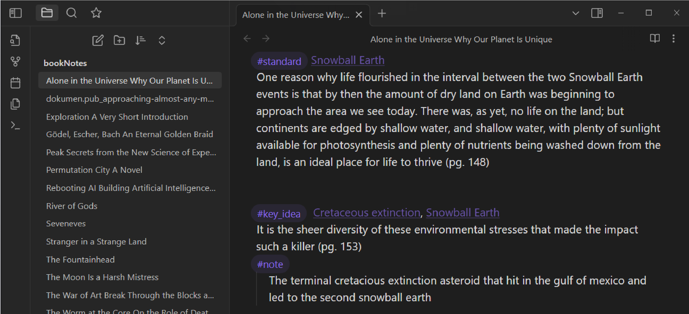

# PocketBook_note_extractor
Extract and convert PocketBook ereader notes from device to markdown files in Obsidian

**Description**

This package extracts and converts note files from a PocketBook ereader to .md files that can be stored in a Obsidian vault. You can define kewords that will be searched for in the notes and added as tags or backlinks in Obsidian. You can also define tags to assign to the color of a note highlight.

**Usage**

    # Connect your ereader to your PC and set the mode to "PC link"
    # Install the package and run the code below
    from PocketBookNoteExtractor import MyCollection
    
    

    # create a collection object that manages imports and exports of pocketbook files
    mycollection = MyCollection(

        # directory where collection will be stored
        base_dir = r'E:\python\PocketbookNoteExtractor', 
        
        # name of PocketBook ereader, will export books and notes when device is connected
        device_name = 'PB741', 
        
        # search through notes for these backlinks
        tags_list = ['Cretaceous extinction', 'Snowball Earth'], 
        
        # define tags mapping to pocketbook highlight colors 
        highlight_semantic_mapping = {
            'bm-color-magenta' : 'key_idea',
            'bm-color-red' : 'key_idea',
            'bm-color-yellow': 'standard',
            'bm-color-green': 'look_into',
            'bm-color-cian': 'summary',
            'bm-color-blue': 'summary',
            'bm-color-note': 'none',
        },
    )

    # export collection to existing obsidian vault
    mycollection.export_to_obsidian(
        vault_dir = r'E:\python\PocketbookNoteExtractor\test_md\bookNotes'
    )

Example of an exported note file in Obsidian:

